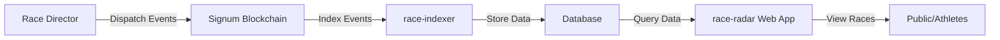

# ER1P Community

> Endurance Race Protocol - Building the future of transparent, blockchain-verified endurance racing

A complete ecosystem for creating, tracking, and verifying endurance races (marathons, ultra-trails, triathlons) on the Signum blockchain. This monorepo contains everything you need to run your own race tracking platform or build custom race applications.

## 🎯 What is ER1P?

ER1P (Endurance Race Protocol) is a decentralized protocol that brings transparency and immutability to endurance racing. All race data—from creation to checkpoint passages—is stored on the Signum blockchain, creating an auditable, tamper-proof record of every race.

**Perfect for:**
- Race directors wanting blockchain-verified results
- Athletes who value data transparency
- Developers building race-related applications
- Running communities exploring Web3 integration

## 📦 What's Inside

This is a [Turborepo](https://turborepo.com) monorepo containing interconnected apps and packages:

### 🚀 Applications

- **[race-radar](./apps/race-radar)** - Public web app for viewing live races and exploring race history (Next.js 15)
- **[race-indexer](./apps/race-indexer)** - Blockchain indexer that syncs race data from Signum blockchain (Bun runtime)

### 📚 Packages

- **[@er1p-community/race-indexer-db](./packages/race-indexer-db)** - Shared database schema & client (Drizzle ORM + libSQL)
- **[@er1p-community/event-ledger](./packages/event-ledger)** - Isomorphic library for dispatching/fetching blockchain events
- **@er1p-community/typescript-config** - Shared TypeScript configurations
- **@er1p-community/eslint-config** - Shared ESLint configurations

## 🏃 Quick Start

### Prerequisites

- [Bun](https://bun.sh) v1.2.15 or later (recommended runtime)
- [Turbo](https://turborepo.com) (optional but recommended)

### Installation

```bash
# Clone the repository
git clone https://github.com/veridibloc/er1p-community.git
cd er1p-community

# Install all dependencies
bun install
```

### Running Applications

```bash
# Run all applications in development mode
turbo dev

# Run a specific app
turbo dev --filter=race-radar
turbo dev --filter=race-indexer

# Or navigate to specific app
cd apps/race-radar
bun dev
```

### Building

```bash
# Build all apps and packages
turbo build

# Build a specific app
turbo build --filter=race-radar
```

## 🛠️ Tech Stack

This project uses modern, high-performance tools:

- **Runtime**: [Bun](https://bun.sh) - Fast JavaScript runtime (4x faster than Node.js)
- **Framework**: [Next.js 15](https://nextjs.org) - React framework with App Router
- **UI**: [React 19](https://react.dev) + [Tailwind CSS 4](https://tailwindcss.com)
- **Database**: [Drizzle ORM](https://orm.drizzle.team) + [libSQL/Turso](https://turso.tech)
- **Blockchain**: [Signum](https://signum.network) via [@signumjs](https://github.com/signum-network/signumjs)
- **Monorepo**: [Turborepo](https://turborepo.com)
- **Language**: [TypeScript](https://www.typescriptlang.org) 100%

## 🏗️ Project Structure

```
er1p-community/
├── apps/
│   ├── race-radar/        # Public-facing Next.js web app
│   └── race-indexer/      # Blockchain indexer (Bun)
├── packages/
│   ├── race-indexer-db/   # Shared database layer
│   ├── event-ledger/      # Blockchain event library
│   ├── typescript-config/ # Shared TS configs
│   └── eslint-config/     # Shared linting configs
└── turbo.json            # Turborepo configuration
```

## 🎓 How It Works

### 1. **Events Go On-Chain**
Race directors use the event-ledger library to dispatch race events (creation, checkpoints, results) to the Signum blockchain.

### 2. **Indexer Syncs Data**
The race-indexer continuously monitors the blockchain, extracts race events, and stores them in a queryable database.

### 3. **Web App Shows Results**
The race-radar Next.js app queries the database and displays live race tracking and historical results to the public.



## 🚀 Use Cases & Building Your Own

### For Race Directors
- Deploy your own race-radar instance to track your events
- Use event-ledger to dispatch race data from your timing system
- Run race-indexer to keep your database synced

### For Developers
- **Build Custom UIs**: Fork race-radar and customize the design
- **Integrate with Timing Systems**: Use event-ledger in your timing software
- **Create Mobile Apps**: Use race-indexer-db schema with your own frontend
- **Analytics Dashboards**: Query the database for race insights
- **Third-party Services**: Build services on top of blockchain race data

### Example: Custom Race App

```typescript
// Install the packages
import { EventLedger } from '@er1p-community/event-ledger';
import { createDatabase } from '@er1p-community/race-indexer-db';
import { createClient } from '@libsql/client';

// Query race data
const db = createDatabase(createClient({ url: 'your-db-url' }));
const liveRaces = await db.query.liveRaces.findMany();

// Dispatch custom events
const eventLedger = new EventLedger(ledger);
await eventLedger.dispatch({ event: myRaceEvent, ... });
```

## 🧑‍💻 Development Workflow

### Working with Packages

```bash
# Build all packages
turbo build --filter='./packages/*'

# Test a specific package
cd packages/event-ledger
bun test
```

### Database Migrations

```bash
# Generate migrations
cd apps/race-indexer
bun run db:generate

# Apply migrations
bun run db:migrate

# Browse database
bun run db:studio
```

### Code Quality

```bash
# Lint all code
turbo lint

# Format with Prettier
bunx prettier --write .
```

## 🤝 Contributing

We welcome contributions from the community! Whether you're fixing bugs, adding features, or improving documentation, here's how to get started:

### Getting Started

1. **Fork the repository** on GitHub
2. **Clone your fork**:
   ```bash
   git clone https://github.com/YOUR_USERNAME/er1p-community.git
   cd er1p-community
   ```
3. **Install dependencies**: `bun install`
4. **Create a branch**: `git checkout -b feature/your-feature-name`

### Making Changes

1. Make your changes in the appropriate app or package
2. Ensure all builds pass: `turbo build`
3. Test your changes thoroughly
4. Follow the existing code style (TypeScript, ESLint rules)
5. Update relevant documentation

### Submitting Changes

1. **Commit your changes**:
   ```bash
   git add .
   git commit -m "feat: add your feature description"
   ```

2. **Push to your fork**:
   ```bash
   git push origin feature/your-feature-name
   ```

3. **Open a Pull Request** on GitHub:
   - Describe what your changes do
   - Reference any related issues
   - Include screenshots for UI changes

### Contribution Guidelines

- **Code Quality**: All TypeScript code must compile without errors
- **Testing**: Test your changes manually or add automated tests
- **Documentation**: Update READMEs if you change APIs or add features
- **Commit Messages**: Use conventional commits format (feat:, fix:, docs:, etc.)
- **Breaking Changes**: Clearly mark and explain any breaking changes

### Areas We Need Help With

- 🎨 **UI/UX Improvements** for race-radar
- 📱 **Mobile App** using React Native
- 📊 **Analytics Features** for race insights
- 🧪 **Testing** - unit tests and integration tests
- 📚 **Documentation** improvements
- 🌍 **Internationalization** (i18n)
- ♿ **Accessibility** improvements

## 📄 License

MIT License - See [LICENSE](./LICENSE) for details.

## 🔗 Links

- **Signum Network**: [signum.network](https://signum.network)
- **Turso Database**: [turso.tech](https://turso.tech)
- **Bun Runtime**: [bun.sh](https://bun.sh)
- **Report Issues**: [GitHub Issues](https://github.com/veridibloc/er1p-community/issues)

## 💬 Community

Have questions or want to discuss ER1P development?

- **GitHub Discussions**: [Start a discussion](https://github.com/veridibloc/er1p-community/discussions)
- **Issues**: [Report bugs or request features](https://github.com/veridibloc/er1p-community/issues)

---

**Built with ❤️ by the Veridibloc team and community contributors**
